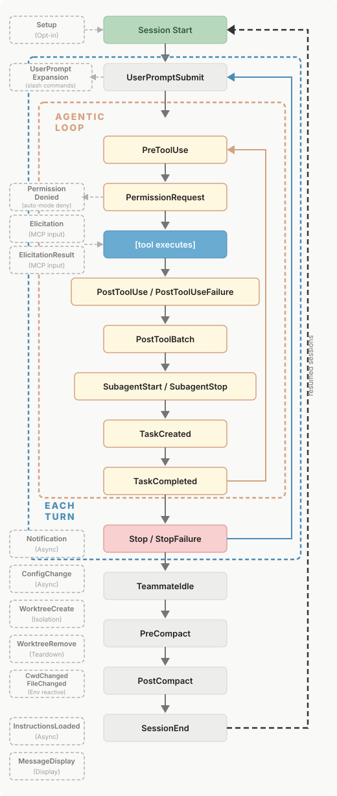

# Claude Code in Action

# Steering Long Sessions

**Compact** - Compact summarizes your conversation, uses that summary as the new context, and deletes the old messages.
This frees up your context window so Claude can keep going. The risk is that something important gets dropped in the
summary, and Claude drifts off course.

So don't just run /compact on its own. Add instructions after the command to tell Claude how to summarize. For example,
if you finished debugging a while back and now you only care about some API changes, say so:

```
/compact Focus on the --version flag implementation
```

**Goal** sets a completion condition. You describe what "done" looks like, and Claude keeps working across turns until a
fast evaluator confirms those conditions are met. It won't just stop the first time it thinks it's finished.

```
/goal all tests in src/billing pass, and the type checker reports zero errors
```

# A CLAUDE.md That Follows

Take a rule like **"never push to main."** If you put that in CLAUDE.md, you're hoping Claude reads it and respects it.
Most of the time it will. But "most of the time" isn't good enough for something that dangerous. A hard rule like that
belongs in a pre-tool-use hook instead.

The difference matters. A hook is code that runs before Claude takes an action, and it can actually block the action. So
even if Claude does try to push to main, the hook stops it. That's real enforcement, not a polite request. Move your
hard rules to hooks and let CLAUDE.md handle the softer conventions.

## The four locations

CLAUDE.md isn't just one file sitting in your project. There are four places it can live, and Claude loads all of them
together at launch. Nothing gets dropped, and they stack.

**Managed policy** — the org-level file your platform team controls. You can't exclude it, so org policy is always in
play. **User** — your personal preferences that follow you across every project on your machine. **Project** — the file
shared with your team, checked into the repo. **Local** — ignored by git. Your personal notes for this one repository
only.

## Split up a big file with imports

When your project file starts getting long, you can break it into pieces using the path-to-file import syntax. Instead
of one wall of text, you point to other files:

- @.claude/conventions/code-style.md
- @.claude/conventions/testing.md
- @.claude/conventions/workflow.md

## Phrasing is what makes rules stick

Once you've decided a rule belongs in CLAUDE.md, whether Claude actually obeys it comes down to how you phrase it. Most
rules fail because they're vague. Here's how to fix that.

### Be specific and checkable

Don't write "follow best practices." Do you even know exactly what that means? If you can't check whether it was
followed, neither can Claude. Compare these two:

- Vague: "Follow best practices for API routes."
- Specific: "Put new API routes in src/api/handlers, one per file."

### Name the replacement, don't just ban something

When you tell Claude not to do something, say what to do instead. Otherwise you've left the door open.

- **Leaves** it open: "Don't use default exports." Okay, but then what?
- **Closes it**: "Use named exports, not default exports."

### Emphasis is a budget

Words like **"IMPORTANT"** and **"YOU MUST"** do raise a rule's priority. But only relative to everything quieter around
it. If every rule shouts, then nothing stands out and the emphasis means nothing. So treat emphasis like a budget. Spend
it on the two or three rules that really hurt when they get broken, and let the rest sit at normal volume.

### Keep the file under revision

Your CLAUDE.md file is never finished. Treat it like living code that keeps getting edited.

When Claude does the wrong thing, don't just sigh and fix it by hand. Treat it as a bug report against your CLAUDE.md
file. You can even tell Claude directly: "add that to the CLAUDE.md file," and it'll write the rule for you. That way
the file gets better every time something goes wrong.

## The bottom line

Treat your CLAUDE.md like production code. If you can't justify a line, delete it. To keep the file lean and followable:

1) Move hard rules to hooks, where they're actually enforced.
2) Organize long files with imports (just remember they don't reduce context).
3) Make every rule specific and checkable, and name the replacement.
4) Spend your emphasis budget on the few rules that matter most.
5) Keep revising the file whenever Claude gets something wrong.

# Verification Skills

## Why a verification skill is the one to build first

Think about how you normally check Claude's work. You ask it to refactor something, it finishes, and then you have to
remember to double-check it. Maybe you ask it to run the tests. Maybe you read the diff yourself. The problem is that
the checking depends on you remembering to ask for it. Skip that step once and bad code slips through.

A verification skill removes that dependency. Here's the shape of it. You ask Claude to refactor something. When it
finishes, the change matches the skill's description, so the skill fires on its own. From there it:

- Runs the test suite.
- Reads the diff.
- Checks that no test was weakened just to make things pass.
- Reports pass or fail, with the evidence attached.

## A skill folder can hold more than instructions

A skill isn't just a single skill.md file. The folder around it can carry other things, and this is what makes skills
powerful for verification.

Drop a reference.md next to the skill for detailed material, then link to it from skill.md. Claude only reads it when it
actually needs that depth. Your main file stays short. Put scripts in the folder too. Claude executes them rather than
loading their contents into context. That means a skill can carry its own tooling, like a check.sh that runs all the
gates.

## Which instruction surface owns which rule

There's a third case. A rule that Claude must not be able to skip belongs in a hook, not in either of the above. That's
because CLAUDE.md and skills are both instructions that Claude follows, while a hook is code that actually runs. If
skipping the rule isn't acceptable, don't leave it up to instruction-following.

## The recap

A skill is a folder with a skill.md inside it: a name, a description that triggers it, and the procedure itself. Only
the descriptions load into context until a skill is actually needed, so there's no cost to packaging every procedure you
repeat.

Start with verification. Build the skill, check it into your project's .claude/skills, and now the whole team inherits
the same move. Everyone's work gets checked the same way, automatically, without anyone having to remember to ask.

# Permission Modes

The six permission modes Here's the full set. Each mode draws a different line between what runs freely and what needs
your sign-off.

- Manual reads only, without prompting. Everything else asks first.
- Accept edits runs reads, file edits, and common file system bash commands without asking. This is for iterating on
  code that you review after the fact.
- Plan reads only. It researches and proposes changes without editing anything.
- Auto accepts everything, with a separate classifier model reviewing each action before it runs.
- Don't ask allows only pre-approved tools. Everything else is auto-denied with no prompt.
- Bypass permissions skips all checks. This is the equivalent of the dangerously-skip-permissions flag. Only run it
  inside an isolated container or virtual machine.

# Hooks

## The hook events

- PreToolUse fires before a tool call. This is your enforcement primitive. It's the one that can stop something before
  it happens.
- PostToolUse fires after a successful tool call. This is usually where auto-formatting or an auto-lint goes.
- Stop fires when Claude wants to end its turn. You can refuse and say "no, you're not done yet" if some condition isn't
  met. There's a matching SubagentStop for when a sub-agent finishes.
- PreCompact and PostCompact fire before and after compaction.
- InstructionsLoaded fires when a CLAUDE.md or rule file loads. Handy for auditing what actually made it into context.
- SessionStart fires at the start and primes the environment. Use the startup source if you only want it on fresh
  starts.



# Routines and Headless

## Routines: a saved prompt that runs in the cloud

A routine is the most direct way to automate a task. There's no script and no server. It bundles three things: a prompt,
the repository it works on, and any connectors it needs. Then it runs that bundle in the cloud whenever it's triggered.

The key part is that the infrastructure is Anthropic's. There's no machine of yours staying on overnight, and there's no
workflow file for you to maintain. You describe the job once and it just runs.

A routine can fire on a few kinds of triggers:

- A cron schedule, like every morning at 9am.
- An HTTP POST to its API endpoint, so your own code can kick it off.
- A GitHub event, like a new pull request landing.

## Two ways to create one

You can create a routine from the web at claude.ai/code/routines. You give it a name, write the instructions describing
what Claude should do in each session, pick a repository, and choose a trigger.

You can also create one from inside Claude Code without leaving your terminal. Just run the /schedule command and
describe what you want in plain language, for example:

```
/schedule daily dependency audit at 9am
```

## Three things to know before you rely on routines

- Routines are a research preview. Behavior and limits will keep moving, so don't be surprised if things change.
- A recurring schedule runs at most hourly. If you need something more frequent, routines aren't the tool.
- Each run starts from a fresh clone of your default branch and can only push to claude/ prefixed branches unless you
  loosen that per repo. This is the guardrail that keeps an autonomous run from rewriting main.

## Headless mode: when you need your own environment

Routines are great when the work fits in the cloud. But sometimes the job needs your environment, or logic wrapped
around the run. That's when you drop to headless mode.

The core of headless mode is the -p flag (short for --print). It runs Claude Code as a one-shot command with no
interactive UI. It reads standard in and writes standard out, so it pipes like any other shell tool:

```
claude -p "summarize the changes in this diff"
```

## Multi-step automation with sessions

For work that happens across multiple steps, you don't have to cram everything into one command. Capture the session's
ID from the JSON output and resume it later:

```
claude --resume "$(jq -r .session_id /tmp/plan.json)"
```

## Which one should you reach for?

Here's the quick decision guide:

- Routines are the default for repeat work. They run on Anthropic's infrastructure with nothing for you to host.
- Headless mode with -p is for when the job needs your pipeline and you want to pipe data through a script.
- --bare is for when CI needs the same results every single run.
- The Agent SDK is for when the work belongs inside your own product.

==================== **IMPORT GitHub Actions and Code Review** ====================

# GitHub Actions and Code Review

## The managed path: Code Review

From there the admin installs the Claude GitHub app, picks which repos it watches, and decides when it runs. You have a
few choices for timing:

- Once when a PR opens
- On every push to the PR
- Only when someone comments @claude review

The nice part is it deduplicates and ranks the findings. So instead of a wall of nitpicks, you read a handful of real
issues worth your attention.

## What Code Review will and won't do

A couple of things to keep in mind about the boundaries here:

- It never approves or blocks the PR. The judgment call stays with a human. Claude flags things; you decide.
- There's no managed autofix. The service posts findings only.
- It's a research preview right now, available on team and enterprise plans, so expect the behavior to keep moving.

## The do-it-yourself path: the GitHub Action

Code Review handles review. When the job goes beyond review, you reach for the GitHub Action. This is for custom CI:
implementing changes from a comment, running scheduled reports, anything you'd normally write a workflow for. It runs
the agent on PR comments, scheduled jobs, and any GitHub event.

Setup starts inside Claude Code. Run the ```/install-github-app command.``` You'll need repo admin to do this. The slash
command walks you through installing the GitHub app and setting the Anthropic API key secret on the repo.

The action itself is ```anthropics/claude-code-action@v1.``` Here are the inputs you'll actually use:

- ```anthropic_api_key``` — optional.
- ```github_token``` — defaults to secrets.GITHUB_TOKEN.
- ```trigger_phrase``` — what the action listens for in comments. Defaults to @claude.
- ```use_bedrock / use_vertex``` — switch to those providers if you're on Bedrock or Vertex.
- prompt — the instruction for the run.
- claude_args — a string of CLI arguments passed straight through to Claude Code.

## A workflow that responds to @claude

Drop a workflow into ```.github/workflows/claude.yaml``` and it listens for ```@claude``` on PR comments and issue
comments. The core step looks like this:

```
- uses: anthropics/claude-code-action@v1
  with:
    anthropic_api_key: ${{ secrets.ANTHROPIC_API_KEY }}
    github_token: ${{ secrets.GITHUB_TOKEN }}
    trigger_phrase: "@claude"
    prompt: "Your instructions here"
    claude_args: "--max-turns 5 --model claude-sonnet-5"
```

Now someone writes ```@claude implement the spec in the linked Linear issue``` on a pull request, and the action picks
it up. Claude pushes commits and posts comments describing what it did.

## A workflow that runs on a schedule

The same action works for a daily rollup. A cron trigger fires at, say, 9:00 UTC, the action runs, and Claude posts the
results. You can also add a ```workflow_dispatch``` trigger so you can kick it off manually from the Actions tab.

When the action runs, you can watch it work through the steps in the Actions tab, just like any other GitHub workflow.

## Tuning the run with claude_args

The claude_args line is where the fine-tuning happens. A few knobs worth knowing:

- --max-turns 5 puts a hard cap on the agent loop, so it can't run forever.
- Permission mode. For an unattended job you'll want it to not stop and ask, since there's no one there to answer.
- Allowed tools. Give the job exactly what it needs and nothing more. For a report, that means read-only.

## Which one should you use?

Here's the short version:

- For PR reviews, take the managed path. Enable Code Review, let the GitHub app post inline findings, and apply fixes
  locally with ```/code-review --fix.```
- Reach for the action when the job is more than review. Use ```/install-github-app``` for setup, one workflow for
  ```@claude```
  mentions, one for cron, and all the tuning lives in ```claude_args.```

Start with the managed service. Move to the action the moment you need Claude to actually do something in CI, not just
comment on it.

https://anthropic.skilljar.com/claude-code-in-action/486936

==================== **IMPORT GitHub Actions and Code Review** ====================

# Trust It: Verifying Unsupervised Runs

## Keep unattended runs in auto mode

When a run goes unattended at work, keep it in auto mode rather than bypass permissions. In auto mode, the classifier
still reviews each action for danger. That's a safety net worth keeping.

## Start with the diff, not the summary

Don't start with Claude's summary of what it did. Start with the diff itself.

- Run /code-review to walk the changes and flag issues.
- Then put your own eyes on git diff.

## Turn tests into a gate, not a promise

The real gate on an unsupervised run is whether the tests passed, and whether Claude actually ran them or only claimed
that it did. Don't leave that to trust. Wire it as a hook so Claude can't skip it.

A couple of hooks do the job:

- A stop hook that runs your tests and refuses to end the turn on a failure.
- A post-tool-use hook that lints and type checks after every edit.

## Get a cold second opinion

The sub-agent code review you'd run before a pull request works here too. Point it at an unsupervised run.

Open a fresh session or sub-agent and have it review the changed code with no memory of how the code was built. Because
it has no stake in the approach, it catches the things the original run talked itself past. A second reviewer with fresh
eyes finds what the author rationalized away.

## Putting it together

Make the check as serious as the run was unsupervised:

- Read the diff yourself.
- Turn the tests into a hook that gates the turn.
- Verify headless runs by their JSON result and exit code.
- Get a cold second opinion on anything that matters.

Do that, and "Claude did it while I wasn't looking" no longer takes faith.

# Plugins

A plugin is one installable unit. It bundles everything you'd otherwise share by hand: skills, subagents, hooks, and MCP
server configs, plus the longer tail of stuff like language server protocol servers, background monitors, themes, and a
slice of settings.json. One version, one install.

Where the plugin lives decides how you install it. Inside a session, you can install one directly by name:

```
/plugin install org-name@plugin-name
```

## Adding a marketplace for your team

For a team, the better move is to add a private marketplace once. A marketplace is a shared source that plugins resolve
through:

```
/plugin marketplace add your-org/claude-plugins
```

Call it whatever you want. Once it's added, every install after that resolves through it. You get centralized discovery,
version tracking, and updates in one place instead of scattered across everyone's laptop.

## Read before you install

Two things worth knowing about where plugins come from:

- The in-app submission form posts to the community marketplace after Anthropic's automated review.
- The official marketplace is curated on its own separate track.

## Components run alongside yours

## Packaging your own plugin

Now the other side. Once you've built a .claude directory that works, don't make your team copy and paste it between
machines. Package it instead.

The good news is you don't have to restructure anything. A plugin uses the same .claude shape you already use:

- One folder per skill.
- One markdown file per subagent under agents.
- hooks/hooks.json and .mcp.json, at the plugin root.

## The manifest

On top of that, there's an optional manifest. It lives at **.claude-plugin/plugin.json** and holds the name, version,
description, and author:

```
{
  "name": "svg-splitter-review",
  "version": "0.1.0",
  "description": "Reviews the SVG Splitter repo",
  "author": {
    "name": "Lewis Menelaws"
  }
}
```

The manifest is optional. Leave it out and Claude Code still discovers your components by directory convention. But a
couple of details are worth knowing:

- Name is the only required field. It namespaces your skills as company-name:skill-name, which keeps them from colliding
  with anyone else's.
- Version it like any other dependency. That's what makes updates and version tracking work across your team.

## The takeaway

Two simple rules cover most of this:

- When you use plugins, read before you install. A plugin runs code with your privileges, so look at its hooks, agents,
  and MCP servers first.
- When you build one, package your .claude the moment it works. One manifest, one install.
-
That's the whole point. One installable unit, and the setup you trust reaches your entire team.